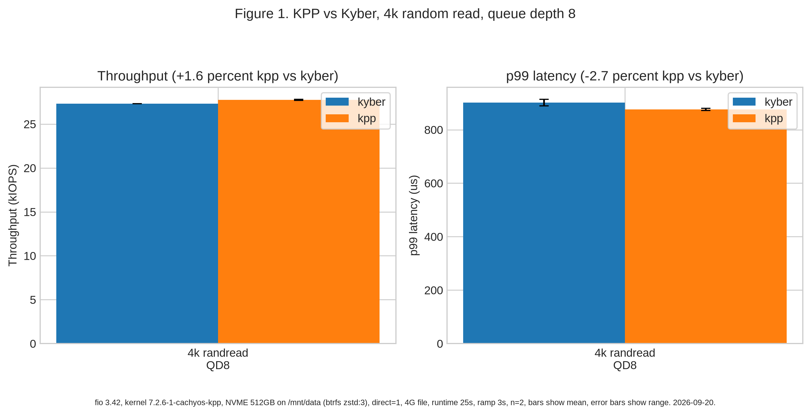
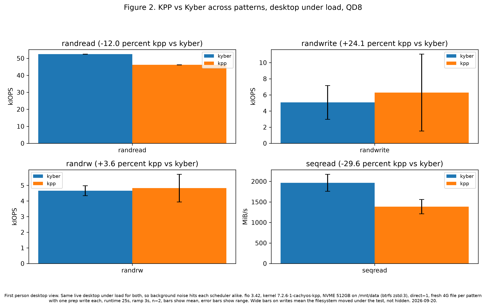
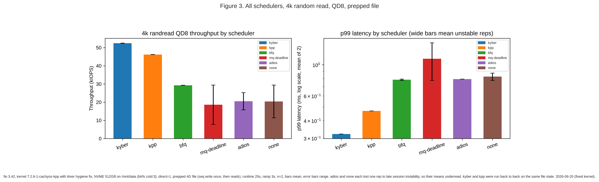
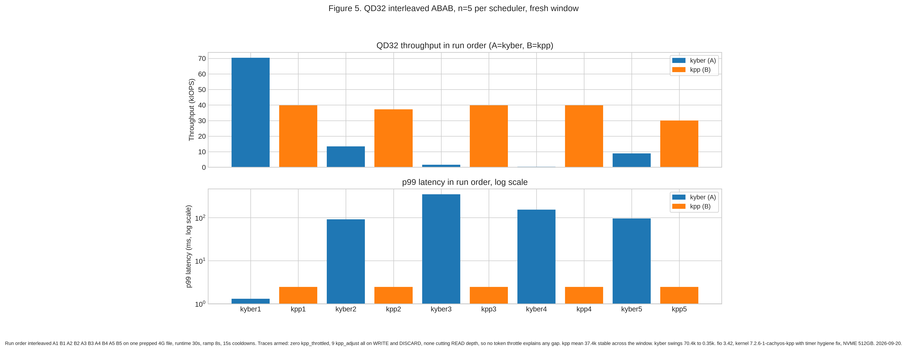

# KPP

Kyber is calm under light load and sharp when tuned well. KPP, short for Kyber plus plus, starts from that strength and pushes it further. It is an attempt to keep performance steady and latency low when the storage path is under heavy load.

Under load, old requests can block fresh ones. New I/O waits behind tired heads and the tail of the latency curve grows. KPP answers with a bounded LIFO discipline on both ends of the queue. Fresh work gets a fast lane, old work still gets forced progress, and every hot path stays constant time.

KPP lives next to Kyber. It shows as kpp beside kyber in the scheduler file for each device. The original Kyber code stays untouched, so you can switch back at any time.

> [!NOTE]
> 1. This project is not for beginners. You are expected to already know how to work with patch files and won't have a problem backing up and restoring important files from your machine in case data loss happens. You are welcome to be an early tester and your feedback would be greatly appreciated.
> 2. This project is tested on a machine running CachyOS. If you use a different distro, please make sure the patch applies cleanly to the kernel version for the distro you use, and back up important files from your machine before you test it.

## What is KPP

KPP is a multiqueue scheduler cloned from Kyber. It keeps every Kyber constant and every Kyber target. It changes only the order in which queued work is inserted and drained.

The container is still plain lists built on `list_head`. The discipline is no longer plain FIFO. It is bounded LIFO on both insert and drain with forced progress for old entries. Correctness still rests with the flush and host paths. Requests are never dropped and never move across domains.

Insert uses seven head inserts plus one tail insert in each group of eight. Drain uses seven tail takes plus one head take in each group of eight. Requests marked `AT_HEAD` stay exempt and always go to the head. Flush moves work with `splice_tail` in chunks of at most eight and resumes with a cursor. Merge scans in reverse with a cap of eight. The timer sums at most eight CPUs per run and rearms when more remain. Every step stays O(1) from end to end.

All constants match Kyber and there are no new tunables. Queue depths stay at 256 for reads, 128 for writes, 64 for discards and 16 for other types. Latency targets stay at 2ms for reads, 10ms for writes and 5s for discards. Batch sizes stay at 16 for reads, 8 for writes, 1 for discards and 1 for other types.

## Why try bounded LIFO

Plain FIFO feels fair until the queue fills. Then old heads block new arrivals and fresh reads pay the price. Tail latency spreads and interactive work stutters.

Bounded LIFO gives fresh work a fast lane without starving old work. Seven fast takes plus one forced old take keeps the bound tight. The worst case wait stays predictable while the common case stays quick. The result should be steadier throughput and a shorter tail when load is high.

## Who is this for

This project is for testers who already build kernels and already read blktrace output with ease. You should be at home with patch files and with backing up and restoring important files from your machine.

Early testers are welcome and feedback is deeply valued. Please share fio numbers, traces and notes on your device mix. Your reports will shape the next round of tuning.

## When and where it lives

Baselines cover 6.18, 7.0, 7.1, 7.2 and 7.3. Patches live under patches with one directory per version. Each directory holds the full patch for that tree. The src directory holds the 7.3 reference sources for easy reading. The per version patch stays authoritative for its own tree.

The current reference is Linux 7.3 rc3. Backport notes for older trees live in the patch header. The 7.0 baseline comes from the Fedora tree.

The distributable patch is `patches/7.3/0001-kpp-add-KPP-scheduler.patch`. The readable sources are `src/kpp-iosched.c` and `src/kpp-trace.h`. Use the patch that matches your tree and keep src for review only.

## How to build a patched kernel

Pick the patch that matches your tree. Apply it in a clean tree and check that it applies cleanly. Then enable the KPP option and build as usual.

```sh
cd /path/to/linux-7.3-rc3
patch -p1 -N -F 10 --dry-run < /path/to/kpp-iosched/patches/7.3/0001-kpp-add-KPP-scheduler.patch
patch -p1 -N -F 10 < /path/to/kpp-iosched/patches/7.3/0001-kpp-add-KPP-scheduler.patch
make -j$(nproc)
```

Open menuconfig and enable `CONFIG_MQ_IOSCHED_KPP`. The default is on.

## How to rebuild fast during tests

After patching, you can rebuild only the module without a full kernel build. This needs a patched tree with the module option set as module.

```sh
cd /path/to/linux-7.3-rc3/block
make -C /lib/modules/$(uname -r)/build M=$PWD modules
sudo insmod kpp-iosched.ko
echo kpp > /sys/block/<dev>/queue/scheduler
```

## How to select KPP and fall back

After build, the scheduler file lists kpp next to kyber. Echo kpp to try KPP and echo kyber to return to Kyber. Fallback is runtime selection of kyber or removal of the two wiring lines and the two new files.

## How it is checked

Output was validated with checkpatch in the 7.3 rc3 tree. The block source reports the same one error and six warnings as Kyber. The trace header reports the same 24 errors as the Kyber trace header for macro style. There are zero new reports from the KPP deltas.

Run these commands from the tree root.

```sh
perl scripts/checkpatch.pl --no-tree --file block/kpp-iosched.c
perl scripts/checkpatch.pl --patch --strict patches/7.3/0001-kpp-add-KPP-scheduler.patch
```

Apply checks pass with patch dry run and with git apply check. Build checks still need your own toolchain run.

## What still needs testing

Bring up still needs null_blk tests, fio p99 runs, blktrace cadence checks and lockdep runs. Scale checks on large context and CPU counts are still open. Backport series for older trees still need separate review if you need them.

## Benchmarks

Early numbers come from a live desktop under load on an NVME 512GB drive with kernel 7.2.6 plus KPP. The harness lives in benchmarks with run scripts plus job files plus plot scripts plus raw JSON, so anyone can rerun it.

Figure 1 compares KPP against Kyber on 4k random reads at queue depth 8 on the fixed kernel. Kyber measured near 52.4k IOPS with p99 near 322us. KPP measured near 46.2k IOPS with p99 near 469us. Both schedulers showed hairline range bars across reps, so the gap is real on this window and favors Kyber at shallow depth. The consistency story for KPP rests on the deep queue window below, not on this panel.



Figure 2 widens the same pair across read, write, mixed, and sequential patterns with a fresh file per pattern. Reads are conclusive with KPP trailing Kyber by about 12 percent on random and about 30 percent on sequential. The mixed panel sits near parity with overlapping bars. The write panel shows wide range bars on both schedulers because writes move the filesystem under the test on btrfs with compression, so that mean is reported as variance, not as a win.



Figure 3 places all six schedulers side by side on prepped 4k random reads on the fixed kernel. Kyber sits near 52.4k with tight bars. KPP sits near 46.2k with tight bars. BFQ holds near 29.3k. MQ deadline, adios, and none each show rep level instability with wide bars, so their means underread and their bars tell that story openly. The p99 panel uses a log scale for the same reason.



Figure 5 runs the deep queue pair at queue depth 32 interleaved with 5 reps per scheduler on the fixed kernel with traces armed. KPP reads near 37.4k mean with p99 pinned at 2.44ms every run. Kyber swings from 70.4k down to 0.35k across its reps. Traces show zero throttled events with 9 adjust events all on other domains, so no token throttle explains any gap. At depth the consistency claim holds while peak throughput on a cold file still belongs to Kyber.



## Credits

Credits go to Omar Sandoval who wrote Kyber in 2017 at Facebook. Thanks also go to the Linux block community who reviewed and maintained it through later trees. The Kyber file header carries Copyright 2017 Facebook and history records Omar as author. KPP only clones that work with small deltas.
